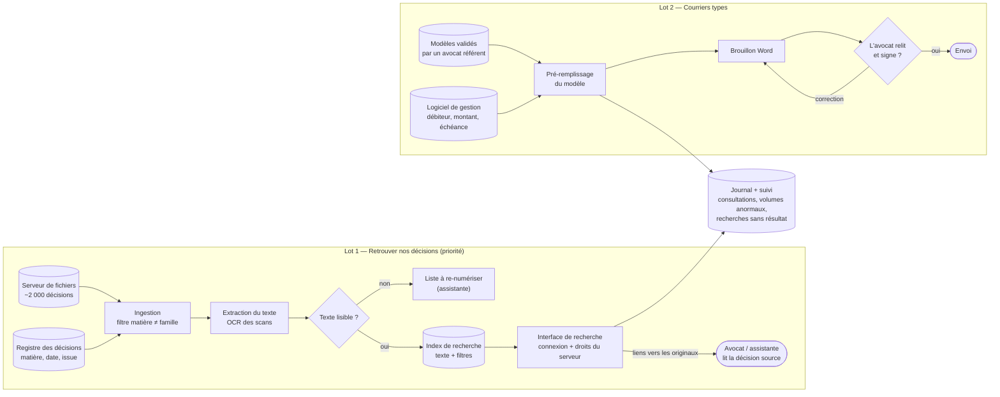

# Schéma d'architecture cible — Cabinet Maître Devalle

> Niveau composants (la stack précise relève de M8-B2). Tout est hébergé **sur le
> serveur du cabinet ou chez un hébergeur français sous contrat** (Q10) : aucun
> flux vers un service hors de France.

**Composants** :
- **Ingestion** : lit le serveur et le registre, **exclut le droit de la famille** (risque §4) et ne prend que le dossier « décisions » (empoisonnement de l'index).
- **Extraction du texte / OCR** : rend les scans cherchables. Le nœud « Texte lisible ? » évite une fausse impression d'exhaustivité en listant ce qui reste introuvable.
- **Index de recherche** : recherche dans le texte, combinée aux filtres du registre (matière, date, issue).
- **Interface de recherche** : connexion du cabinet, **droits repris du serveur de fichiers**, résultats sous forme de **liens vers les documents originaux**. Il n'y a aucun texte généré, donc aucune décision inventée.
- **Pré-remplissage** : remplit les modèles validés **depuis le logiciel de gestion**, ce qui évite toute saisie ou génération de montant ou de délai.
- **Validation humaine** : l'avocat relit et signe avant tout envoi (processus actuel conservé, Q3).
- **Journal + suivi** : sert à la sécurité (volumes anormaux, exfiltration) et aux KPI (temps de recherche, recherches sans résultat).

**Ce qu'on n'a PAS mis** (et pourquoi) :
- **Pas de LLM génératif** : le risque n°1 est l'invention (Q7), et ni la recherche ni les courriers types n'en ont besoin.
- **Pas de base vectorielle ni de RAG** : la recherche plein texte et les filtres du registre sont essayés d'abord. Une recherche sémantique ne serait ajoutée que si le jeu de test (§3) montre qu'elle rate trop de décisions.
- **Pas de jurisprudence publique** : elle est déjà couverte par l'abonnement du cabinet (Q12).
- **Pas de réentraînement** sur les retours des utilisateurs : il n'y a pas de modèle entraîné, donc pas de boucle d'empoisonnement.
- **Pas de statistiques par avocat** : elles feraient basculer l'outil en haut risque (§4, Annexe III 4 b).
